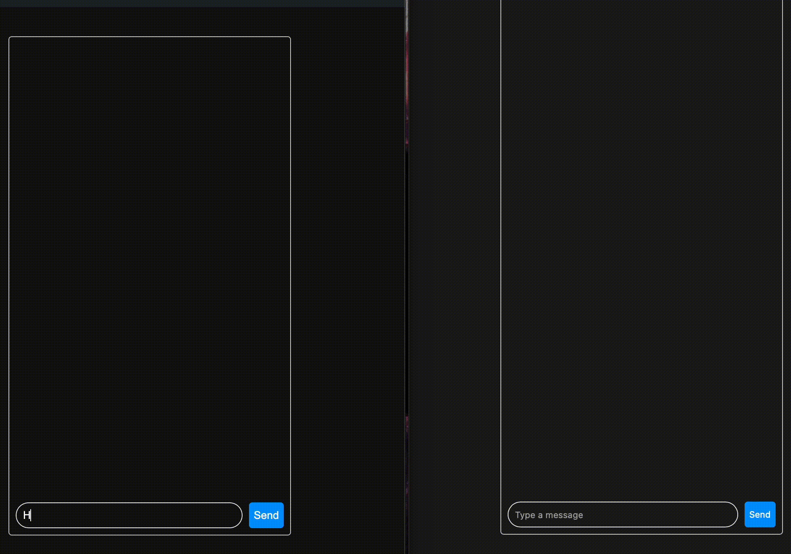

# Node.js Realtime Chat

Realtime chat built with Node.js, Socket.io, HTML and CSS.



To run locally, install dependencies:

```
npm install
```

Configure your database and add environment variables to `.env` file. For this project, I use Turso for a SQLite instance.

Run the server:

```
npm run dev
```
